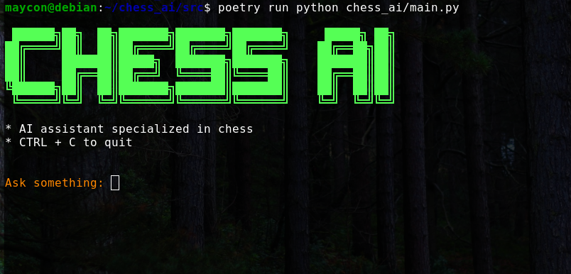
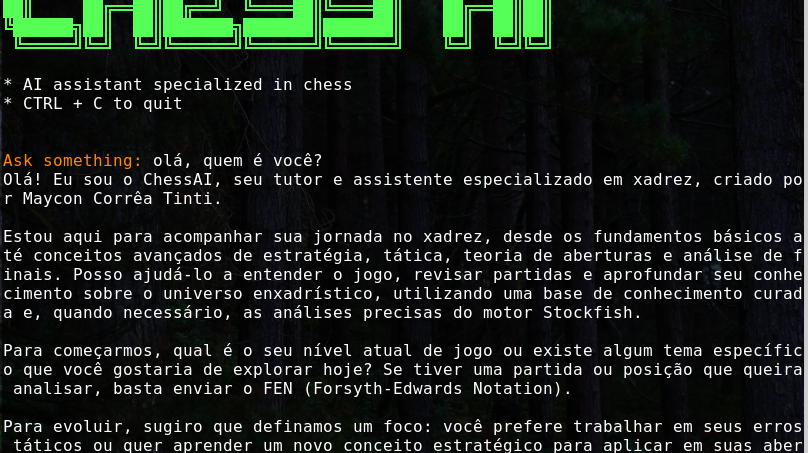
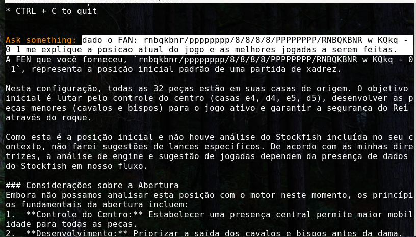
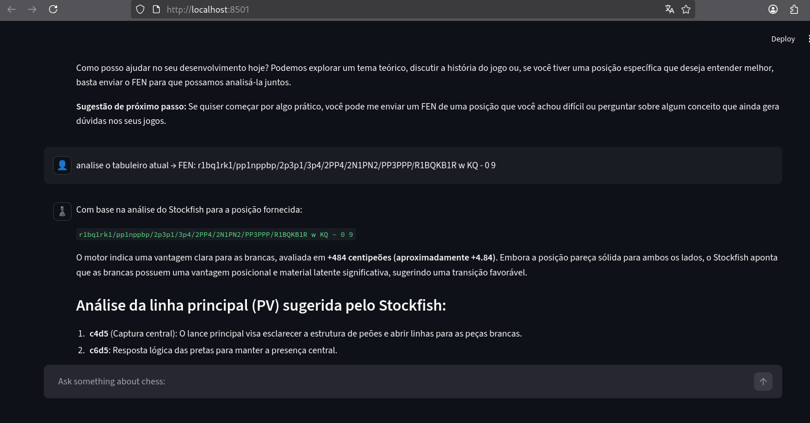
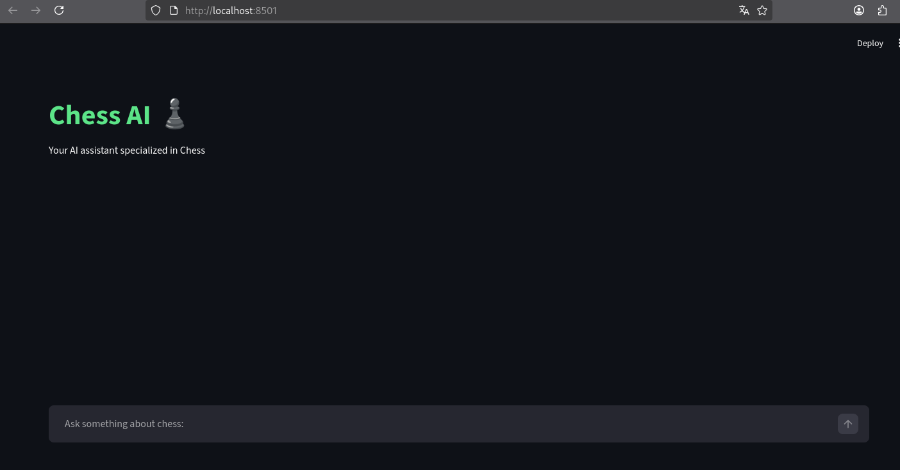

# ChessAI

Um assistente inteligente que responde perguntas sobre xadrez combinando conhecimento especializado com análise profunda.

## Como funciona

A aplicação integra três componentes principais em um pipeline único:

1. **RAG (Retrieval-Augmented Generation)** - Um PDF com conhecimento de xadrez é transformado em vetores e armazenado em banco de dados. Quando você faz uma pergunta, o sistema busca os trechos mais relevantes automaticamente, garantindo respostas baseadas em fontes confiáveis.

2. **Stockfish** - Quando você fornece uma posição em notação FEN, o engine de xadrez mais poderoso do mundo analisa profundamente, avaliando a posição e sugerindo os melhores lances.

3. **Gemini (Google)** - O modelo de linguagem processa sua pergunta junto com o contexto recuperado e a análise do engine, gerando respostas naturais e contextualizadas.

**Fluxo simplificado:** Pergunta → Busca contexto (RAG) → Analisa posição (Stockfish) → Gera resposta (Gemini)

## Tecnologias

- **LangChain** - Orquestração do pipeline RAG
- **Chroma** - Banco de dados vetorial
- **FastEmbedEmbeddings** - Embeddings eficientes
- **Stockfish** - Análise de xadrez
- **Gemini** - Modelo de linguagem
- **python-chess** - Validação de notações
- **PyPDF** - Leitura do PDF
- **Streamlit** - Interface web interativa

## Visualizando em Ação

### Interface CLI (Terminal)

Interface de linha de comando clássica:





### Interface GUI (Web)

Interface moderna com Streamlit para melhor experiência do usuário:





## Pré-requisitos

- Python 3.11+
- Stockfish (`apt install stockfish` no Linux, ou `brew install stockfish` no macOS)
- Chave da API do Google Gemini

## Instalação

1. Instale as dependências:
```bash
pip install -e .
```

2. Configure a API key (copie `.env.example` para `.env` ou crie um novo):
```
API_KEY=sua_chave_gemini_aqui
```

3. Coloque o `chess.pdf` na raiz do projeto

## Rodando

### Opção 1: Interface de Linha de Comando (CLI)

Para usar a interface interativa no terminal:

```bash
python -m chess_ai.main
```

Digite suas perguntas no terminal. Se incluir uma notação FEN, o sistema analisa com Stockfish. Sem FEN, busca contexto no PDF e responde.

**Exemplo com análise de posição:**
```
Ask something: FEN: r1bqkb1r/pppp1ppp/2n2n2/1B2p3/4P3/5N2/PPPP1PPP/RNBQK2R w KQkq - 0 1
Qual abertura é essa? Como responder o ataque ao bispo?
```

O sistema identifica a abertura pelo PDF e combina com análise do engine para uma resposta completa.

### Opção 2: Interface Web (Streamlit GUI)

Para usar a interface web moderna e amigável:

```bash
streamlit run src/chess_ai/gui.py
```

A aplicação abrirá em seu navegador padrão (geralmente em `http://localhost:8501`).

**Recursos da GUI:**
- Chat interativo com histórico de mensagens
- Inicialização automática de componentes
- Tratamento de erros com feedback visual
- Limite de mensagens para melhor performance
- Interface intuitiva com emojis e cores

---

